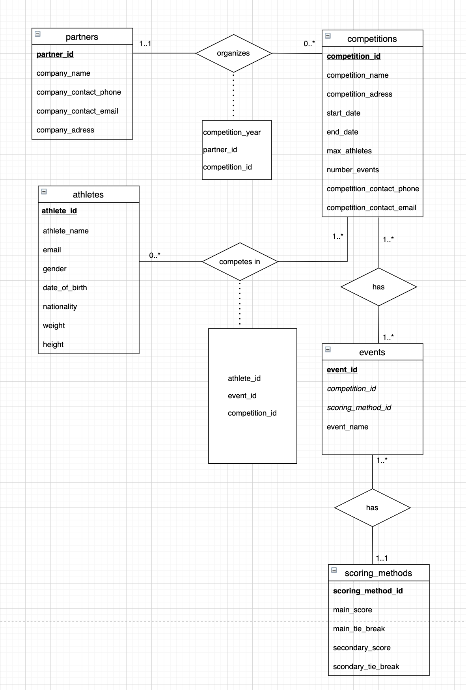
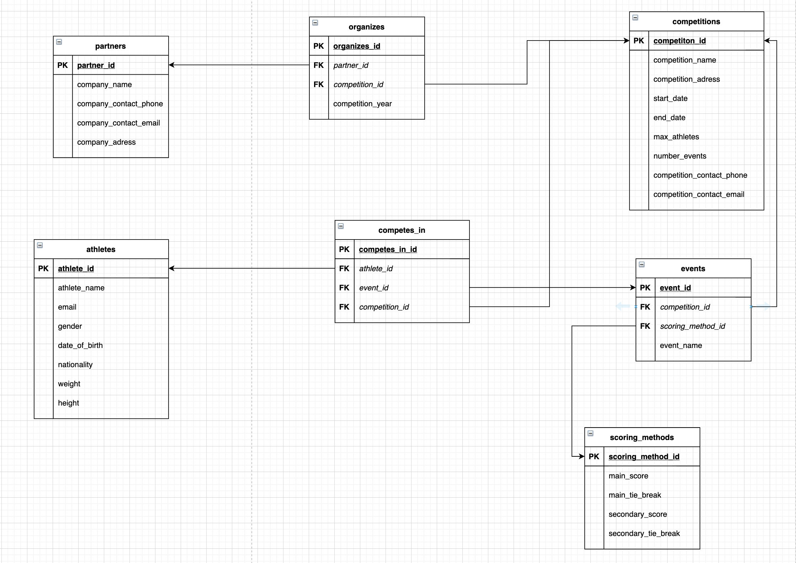

# Lab07

I have provided the schema , the seed and the diagrams.

## Event Matrix

### Im not going to do this part since we have 4 columns where each one has 5 possible values. In total we're going to have 4^5 - 1(main score is null ) row which is alot to do .  

## Models

## ER diagram 

## Relational diagram

