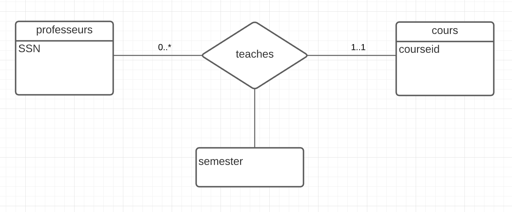
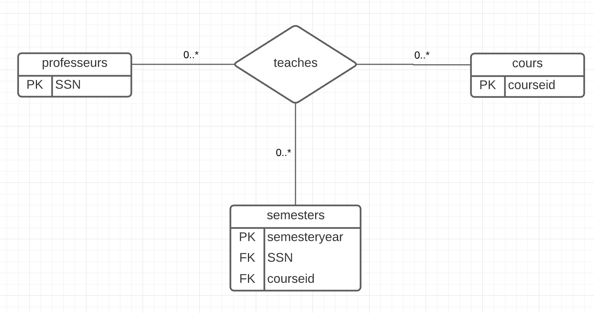
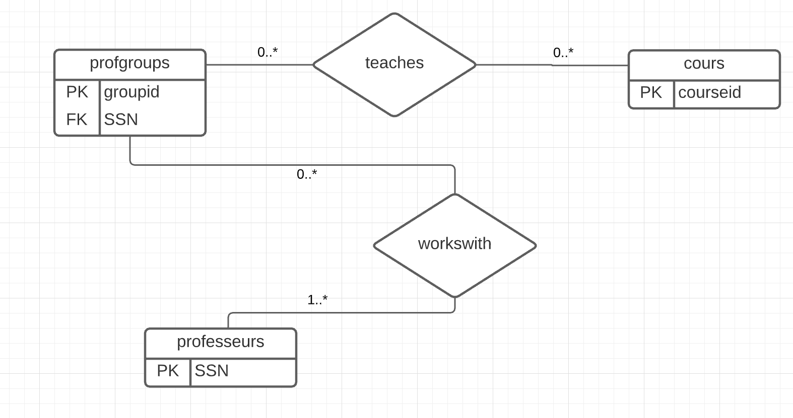

# csi2532_playground 

|Full Name |student number |
|-----|------|
|Ayman fakri| 300120735|

## 1:
Here professors can teach the same course on multiple semesters and the recent one is recorded. Here I assumed that the recent semester is what is recorded and that professors can have 0 courses and that a professor can teach multiple classes

## 2:
Here professors should teach at least one class. I assumed that courses can be taught by multiple professors

## 3:
Here a professor has to teach only one class, assuming that a course could be taught by multiple professors
 

## 4:
Here a can teach one and only one course but courses can be taught by at least one professor

## 5:
This is the same case the the first one the only difference is that we need to keep track of all the semesters. To do that I added a new entity semesters to the relation . The primary key is the semester and the year. It has two foreign keys so that each semester could be linked with a professor and a course.

## 6:
Here we are given the possibility that a course could be taught by group of professors. Here I assumed that a group 

