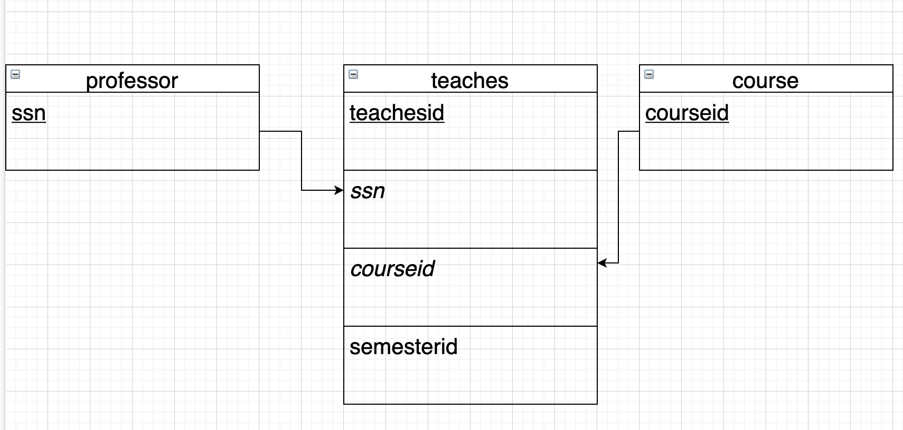
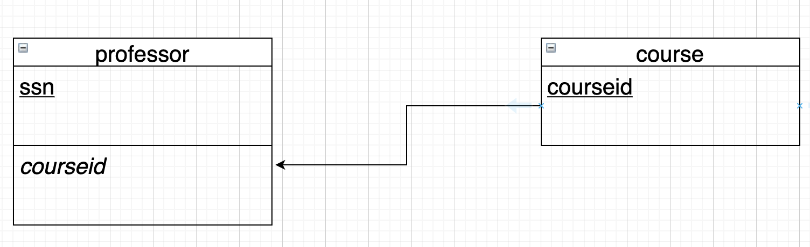
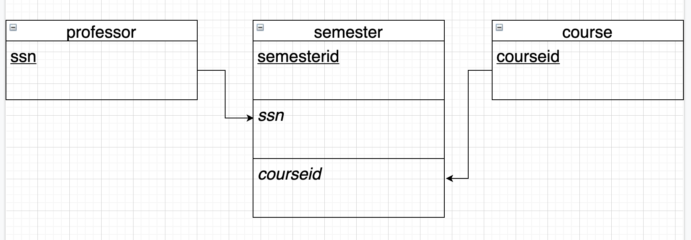

# csi2532_playground
## Lab04
|Student name| Student number| 
|-------------|--------------|
|Ayman Fakri  |300120735     |

All the diagrams where made using [Draw.io](https://app.diagrams.net/)
### 1-


```sql
CREATE TABLE course(
courseid int,
PRIMARY KEY(courseid)
);

CREATE TABLE professor(
ssn int,
PRIMARY KEY(ssn)
);

CREATE TABLE teaches(
id int,
ssn int,
courseid int,
semesterid int,
PRIMARY KEY(id),
FOREIGN KEY(courseid)
REFERENCES course(courseid),
FOREIGN KEY(ssn)
REFERENCES professor(ssn)
);
```
### 3-


```sql
CREATE TABLE course(
courseid int,
PRIMARY KEY(courseid)
);

CREATE TABLE professor(
ssn int,
courseid,
PRIMARY KEY(ssn),
FOREIGN KEY(courseid)
REFERENCES course(courseid)
);
```

### 5-


```sql
CREATE TABLE course(
courseid int,
PRIMARY KEY(courseid)
);

CREATE TABLE professor(
ssn int,
PRIMARY KEY(ssn)
);

CREATE TABLE semester(
semesterid int,
ssn int,
courseid int,
PRIMARY KEY(semesterid),
FOREIGN KEY(courseid)
REFERENCES course(courseid),
FOREIGN KEY(ssn)
REFERENCES professor(ssn)
);
```
### 6-


```sql
CREATE TABLE professor(
ssn int,
PRIMARY KEY(ssn)
);

CREATE TABLE profgroup(
groupid int,
ssn int,
PRIMARY KEY(groupid),
FOREIGN KEY(ssn)
REFERENCES professor(ssn)
);

CREATE TABLE course(
courseid int,
groupid int,
PRIMARY KEY(courseid),
FOREIGN KEY(groupid)
REFERENCES profgroup(groupid)
);
```